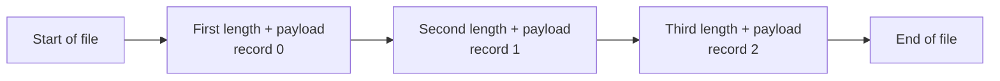
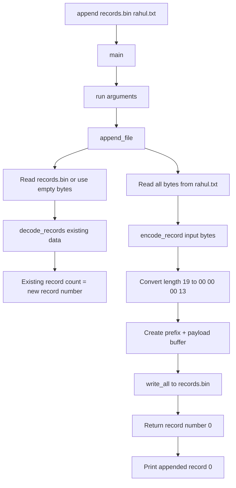
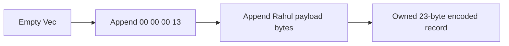
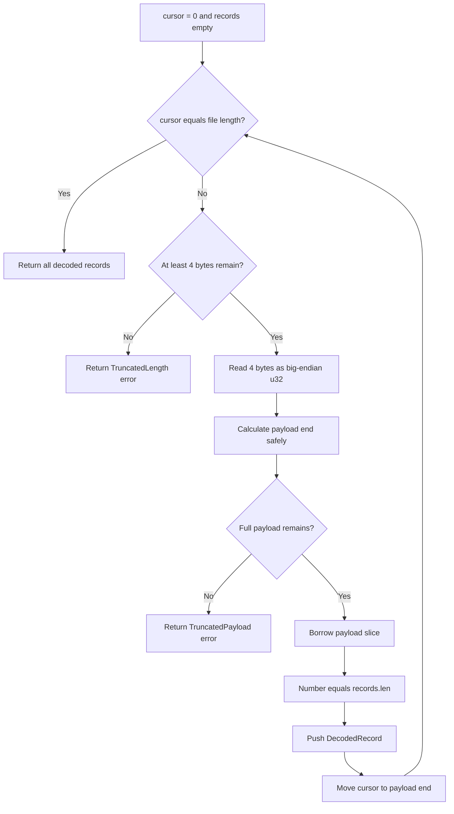
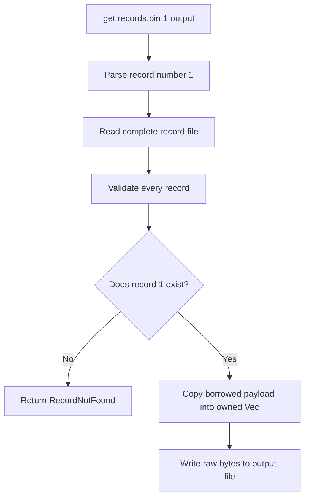
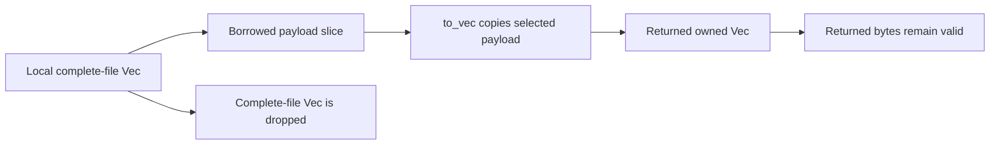

# How the Binary Record CLI Processes Data

## The shortest explanation

Each record is stored in two parts:

```text
+--------------------------+-------------------------+
| 4-byte payload length    | N payload bytes         |
+--------------------------+-------------------------+
| says how many bytes next | contains the real data  |
+--------------------------+-------------------------+
```

The first four bytes are **not an identifier**. They contain the payload's
length.

The record number is also **not currently stored inside the file**. Record
numbers are calculated from position:

```text
first encoded record  -> record 0
second encoded record -> record 1
third encoded record  -> record 2
```

For the text:

```text
rahul is a good boy
```

the result is:

```text
00 00 00 13 | 72 61 68 75 6c 20 69 73 20 61 20 67 6f 6f 64 20 62 6f 79
------------   --------------------------------------------------------
length = 19                         payload
```

`0x13` is hexadecimal for decimal `19`. The complete encoded record occupies
`4 + 19 = 23` bytes.

## First correction: what the CLI accepts

The current `append` command accepts an **input filename**, not literal text on
the command line.

You first create an input file containing:

```text
rahul is a good boy
```

Then run:

```bash
cd /mnt/d/storage-engine/cli
cargo run -- append records.bin rahul.txt
```

The CLI reads every byte from `rahul.txt` and stores those bytes as one record
inside `records.bin`.

This design is intentional because it supports both text and arbitrary binary
files:

```text
rahul.txt  ─┐
photo.jpg  ─┼──> append command ──> records.bin
audio.mp3  ─┤
any.bin    ─┘
```

## Text, characters, and bytes

A computer ultimately stores bytes—numbers between `0` and `255`.

Text must use an encoding that maps characters to bytes. Rust strings use
UTF-8. For ordinary English letters, UTF-8 uses the same one-byte values as
ASCII.

```text
character    decimal byte    hexadecimal byte
------------------------------------------------
r            114             72
a             97             61
h            104             68
u            117             75
l            108             6c
space         32             20
```

The full example becomes:

| Position | Character | Decimal byte | Hex byte |
|---:|:---:|---:|:---:|
| 0 | `r` | 114 | `72` |
| 1 | `a` | 97 | `61` |
| 2 | `h` | 104 | `68` |
| 3 | `u` | 117 | `75` |
| 4 | `l` | 108 | `6c` |
| 5 | space | 32 | `20` |
| 6 | `i` | 105 | `69` |
| 7 | `s` | 115 | `73` |
| 8 | space | 32 | `20` |
| 9 | `a` | 97 | `61` |
| 10 | space | 32 | `20` |
| 11 | `g` | 103 | `67` |
| 12 | `o` | 111 | `6f` |
| 13 | `o` | 111 | `6f` |
| 14 | `d` | 100 | `64` |
| 15 | space | 32 | `20` |
| 16 | `b` | 98 | `62` |
| 17 | `o` | 111 | `6f` |
| 18 | `y` | 121 | `79` |

There are 19 characters and, for this English-only example, 19 bytes.

Character count and byte count are not always equal. For example, many emoji
use four UTF-8 bytes even though a person sees one symbol. Our file format
stores **byte length**, not visible-character count.

## Why the length uses four bytes

One byte can represent 256 different unsigned values:

```text
0 through 255
```

Two bytes can represent:

```text
0 through 65,535
```

Three bytes can represent:

```text
0 through 16,777,215
```

Four bytes can represent:

```text
0 through 4,294,967,295
```

| Length field | Maximum representable payload | Approximate size |
|---:|---:|---:|
| 1 byte | 255 bytes | 255 B |
| 2 bytes | 65,535 bytes | 64 KiB |
| 3 bytes | 16,777,215 bytes | 16 MiB |
| 4 bytes | 4,294,967,295 bytes | 4 GiB minus 1 byte |

We chose four bytes because:

- it is a standard Rust integer type: `u32`;
- encoding and decoding it is simple;
- its size is fixed, so the decoder always knows to read exactly four bytes;
- it can describe small and large payloads;
- four bytes of overhead per record is small for this learning project.

It is not the only possible choice. We could use:

- one byte for very small messages;
- two bytes if messages never exceed about 64 KiB;
- eight bytes for extremely large messages;
- a variable-length integer to reduce small-record overhead.

Each choice creates a trade-off. A variable-length integer saves space but
makes parsing more complicated. Four fixed bytes keep the first exercise easy
to inspect and test.

The CLI can theoretically encode a `u32` payload length, but practical file and
memory limits will be smaller. The main replicated-log protocol will impose a
much smaller configured message limit, such as 8 MiB, to protect memory.

## Big-endian byte order

The program stores the four-byte length in big-endian order: the most
significant byte comes first.

Decimal 19 equals hexadecimal `0x13`. As a four-byte `u32`, it becomes:

```text
decimal:      19
hex number:   00000013
file bytes:   00 00 00 13
```

Another example, decimal 300:

```text
hex number:   0000012c
file bytes:   00 00 01 2c
```

Both encoder and decoder must agree on byte order. The code uses:

```rust
payload_length.to_be_bytes()
u32::from_be_bytes(length_bytes)
```

`be` means big-endian.

## What record numbers mean

The current format stores no explicit record ID or offset. The decoder starts
at the beginning and counts every valid record it encounters.



If `records.bin` is initially empty, appending Rahul's text produces record 0.

If two records already exist, Rahul's text becomes record 2.

```text
file order                  calculated record number
-----------------------------------------------------
first length + payload      0
second length + payload     1
third length + payload      2
```

These record numbers are positional indexes. They are not yet the durable
offsets used by the future storage engine.

The future engine's disk format will store the offset explicitly because it
must detect gaps, duplicates, corruption, and disagreement between replicas.
This CLI is an earlier and simpler exercise.

## Complete append flow for `rahul is a good boy`

Assume:

- `rahul.txt` contains exactly 19 bytes with no newline at the end;
- `records.bin` is empty;
- the command is run from the `cli` directory.

```bash
cargo run -- append records.bin rahul.txt
```

### High-level flow



### Function call flow

```text
main()
└── run(arguments)
    └── append_file(records.bin, rahul.txt)
        ├── read_path(rahul.txt, "read input file")
        │   └── std::fs::read
        ├── std::fs::read(records.bin)
        ├── decode_records(existing_bytes)
        ├── encode_record(input_bytes)
        │   ├── u32::try_from(payload.len())
        │   ├── u32::to_be_bytes()
        │   └── Vec::extend_from_slice()
        ├── OpenOptions::open(records.bin)
        └── Write::write_all(encoded_record)
```

### Step 1: `main` receives command-line arguments

The operating system gives the program arguments similar to:

```text
append
records.bin
rahul.txt
```

`main` removes the executable name and passes the remaining arguments to
`run`.

### Step 2: `run` validates the command

`run` checks:

- the command is `append`;
- exactly two additional arguments exist;
- `records.bin` is the destination record file;
- `rahul.txt` is the input payload file.

It then calls:

```rust
append_file(Path::new("records.bin"), Path::new("rahul.txt"))
```

### Step 3: `append_file` reads the input

`read_path` calls `std::fs::read`. Rust returns an owned `Vec<u8>`:

```text
[114, 97, 104, 117, 108, 32, 105, 115, 32, 97,
 32, 103, 111, 111, 100, 32, 98, 111, 121]
```

The hexadecimal form is:

```text
72 61 68 75 6c 20 69 73 20 61 20 67 6f 6f 64 20 62 6f 79
```

The `input` variable owns these 19 bytes.

### Step 4: validate the existing record file

If `records.bin` does not exist, the function treats its current contents as
an empty `Vec<u8>`.

If it exists, the function reads and completely validates it using
`decode_records` before appending anything.

This prevents adding valid new data after an already malformed record.

For an empty file:

```rust
decode_records(&existing)?.len()
```

returns `0`, so the new record number is `0`.

### Step 5: `encode_record` checks the size

`payload.len()` returns `19` as a `usize`. The stored length field must be a
`u32`, so the code uses a checked conversion:

```rust
let payload_length = u32::try_from(payload.len())?;
```

This prevents a too-large length from silently wrapping into the wrong number.

### Step 6: encode the four-byte length

The code performs:

```rust
payload_length.to_be_bytes()
```

For 19, the result is:

```text
[0, 0, 0, 19]
```

In hexadecimal:

```text
00 00 00 13
```

### Step 7: build one owned output buffer

`encode_record` creates a `Vec<u8>` with enough capacity for 4 prefix bytes
plus 19 payload bytes.

```text
capacity = 4 + 19 = 23 bytes
```

It appends the prefix and then the payload:



Final decimal bytes:

```text
[0, 0, 0, 19,
 114, 97, 104, 117, 108, 32, 105, 115, 32, 97,
 32, 103, 111, 111, 100, 32, 98, 111, 121]
```

Final hexadecimal bytes:

```text
00 00 00 13 72 61 68 75 6c 20 69 73 20 61 20 67 6f 6f 64 20 62 6f 79
```

### Step 8: append all 23 bytes

The record file is opened with:

- `create(true)`: create it if missing;
- `append(true)`: write only at the end.

The code uses `write_all(&encoded)`. A basic `write` is allowed to write fewer
bytes than requested; `write_all` keeps writing until the buffer is complete or
an error occurs.

### Step 9: return and print the record number

`append_file` returns:

```rust
Ok(0)
```

`run` prints:

```text
appended record 0
```

## What the file looks like after several appends

Imagine we append these three input files:

```text
cat
rahul is a good boy
OK
```

Their lengths are 3, 19, and 2 bytes.

```text
record 0
00 00 00 03 | 63 61 74

record 1
00 00 00 13 | 72 61 68 75 6c 20 69 73 20 61 20 67 6f 6f 64 20 62 6f 79

record 2
00 00 00 02 | 4f 4b
```

The physical file contains no labels or separator lines:

```text
00 00 00 03 63 61 74
00 00 00 13 72 61 68 75 6c 20 69 73 20 61 20 67 6f 6f 64 20 62 6f 79
00 00 00 02 4f 4b
```

The line breaks above are only for humans reading the diagram.

## Complete decode flow

`decode_records` receives a borrowed byte slice representing the entire file.



### Decoding record 0: `cat`

The decoder begins at byte position 0:

```text
cursor = 0
next four bytes = 00 00 00 03
decoded length = 3
payload begins at byte 4
payload ends before byte 7
payload bytes = 63 61 74
record number = records.len() = 0
new cursor = 7
```

### Decoding record 1: Rahul

The next record begins at byte position 7:

```text
cursor = 7
next four bytes = 00 00 00 13
decoded length = 19
payload begins at byte 11
payload ends before byte 30
record number = records.len() = 1
new cursor = 30
```

### Decoding record 2: `OK`

```text
cursor = 30
next four bytes = 00 00 00 02
decoded length = 2
payload begins at byte 34
payload ends before byte 36
record number = records.len() = 2
new cursor = 36
```

At `cursor = file length = 36`, decoding succeeds.

## The `list` command flow

Command:

```bash
cargo run -- list records.bin
```

Function flow:

```text
main()
└── run(arguments)
    └── list_file(records.bin)
        ├── read_path(records.bin)
        ├── decode_records(&bytes)
        └── map each decoded record to RecordInfo
```

Diagram:


Output for the three-record example:

```text
0: 3 bytes
1: 19 bytes
2: 2 bytes
```

The list command does not treat payloads as strings. This is important because
an image, audio file, or random bytes may not be valid UTF-8 and may damage
terminal display if printed directly.

## The `get` command flow

Command:

```bash
cargo run -- get records.bin 1 rahul-recovered.txt
```

Function flow:

```text
main()
└── run(arguments)
    ├── parse "1" as usize
    ├── get_file(records.bin, 1)
    │   ├── read_path(records.bin)
    │   ├── decode_records(&bytes)
    │   ├── records.get(1)
    │   └── payload.to_vec()
    └── write_output(rahul-recovered.txt, payload)
```

Diagram:



The output file receives only:

```text
72 61 68 75 6c 20 69 73 20 61 20 67 6f 6f 64 20 62 6f 79
```

The four-byte length prefix is not included in extracted output.

## Why decoding borrows but `get_file` copies

`read_path` owns the complete file in a `Vec<u8>`:

```text
bytes: Vec<u8>
┌──────────────────────────────────────────────┐
│ length 0 │ payload 0 │ length 1 │ payload 1 │
└──────────────────────────────────────────────┘
              ↑                    ↑
              borrowed slices point inside bytes
```

`decode_records(&bytes)` returns payload slices such as `&bytes[4..7]`. It
avoids copying all payloads just to validate or list the file.

But `bytes` is a local variable inside `get_file`. It is dropped when
`get_file` finishes. Returning a borrowed slice pointing inside it would leave
a reference to freed memory. Rust correctly prevents that.

Therefore `get_file` performs:

```rust
record.payload.to_vec()
```

The returned `Vec<u8>` owns its bytes and remains valid after the complete file
buffer is dropped.



## How malformed input is detected

### Case 1: incomplete length

File ends with only:

```text
00 00 00
```

The decoder needs four bytes but finds only three. It returns:

```text
TruncatedLength
```

### Case 2: length says five but only two payload bytes exist

```text
00 00 00 05 | aa bb
```

The decoder calculates that five bytes are required but only two remain. It
returns:

```text
TruncatedPayload
```

### Case 3: requested record is missing

If the file contains records 0, 1, and 2 but the user requests 7:

```text
RecordNotFound {
    requested: 7,
    record_count: 3
}
```

### Case 4: existing destination is already malformed

Before appending, `append_file` decodes the entire destination file. If it is
malformed, append stops without adding new bytes. This preserves the evidence
of the original problem and prevents a valid new record from being hidden
behind corruption.

## What `Result` is doing

Operations that may fail return:

```rust
Result<success_value, RecordFileError>
```

Examples:

```text
encode_record       -> Result<Vec<u8>, RecordFileError>
decode_records      -> Result<Vec<DecodedRecord>, RecordFileError>
append_file         -> Result<usize, RecordFileError>
list_file           -> Result<Vec<RecordInfo>, RecordFileError>
get_file            -> Result<Vec<u8>, RecordFileError>
write_output        -> Result<(), RecordFileError>
```

The `?` operator means:

```text
if successful -> unwrap the success value and continue
if failed     -> return that error from the current function immediately
```

This keeps expected failures explicit without using `panic!`.

## Important limitations of this practice format

This CLI format is intentionally smaller than the future storage-engine
format. It currently has:

- no stored offset;
- no checksum;
- no timestamp;
- no leader epoch;
- no flags;
- no segment files;
- no durability mode or explicit disk synchronization;
- no streaming decode; it loads the complete file into memory.

The future engine record will resemble:

```text
+-----------+----------+--------+-------+-----------+-------+-------------+---------+
| total len | checksum | offset | epoch | timestamp | flags | payload len | payload |
+-----------+----------+--------+-------+-----------+-------+-------------+---------+
```

This CLI teaches the smallest core idea first: self-delimiting arbitrary binary
records with safe parsing and clear ownership.

## Final mental model

Think of a delivery warehouse:

- the four-byte prefix is a label saying how large the next parcel is;
- the payload is the parcel's contents;
- the record number is the parcel's position in the row;
- the decoder is a worker who reads a size label, takes exactly that many
  bytes, assigns the next row number, and repeats;
- a missing label or incomplete parcel stops processing with an error.

For Rahul's message:

```text
label:    the next parcel contains 19 bytes
contents: rahul is a good boy
position: record 0 if it is first in the file
```

The exact stored result is:

```text
00 00 00 13 | 72 61 68 75 6c 20 69 73 20 61 20 67 6f 6f 64 20 62 6f 79
```
